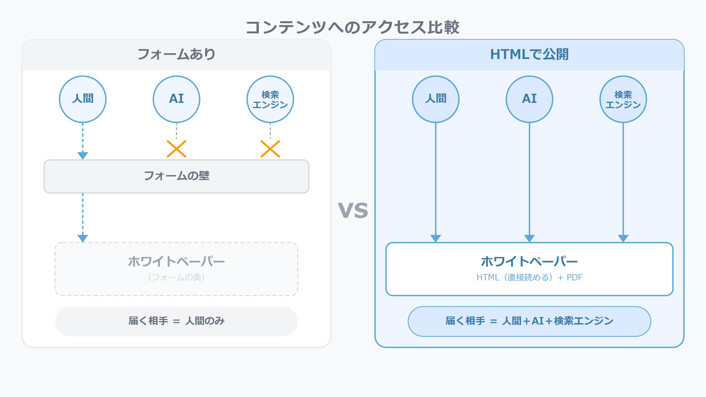
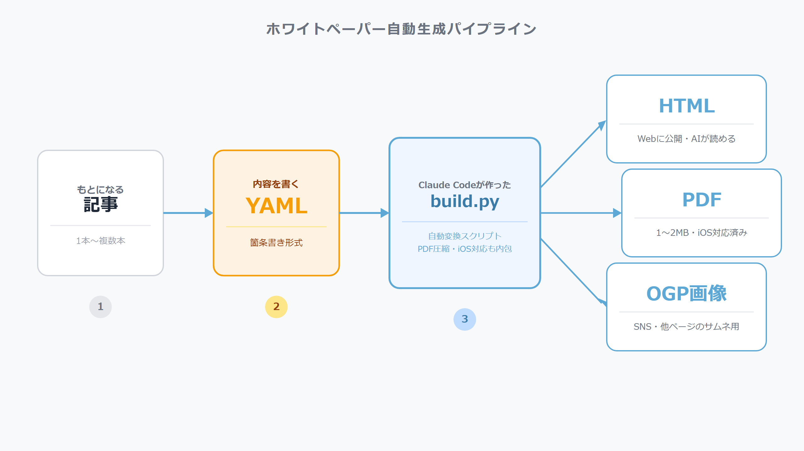

## PDFをフォームの奥に置かず、AIが読める場所に出す

うちの会社では、Webからの問い合わせを増やすために記事や動画を定期的に作っています。その一環として「ホワイトペーパー」があります。業界の課題や判断基準をまとめた資料で、フォームに名前と連絡先を入れた人だけに届ける形の配布物です。

2026年に入ってアクセス解析を見ていると、AIのエージェントと思われる流入が前期比で数倍に増えていました。その中に、うちのサイトには実在しないURLを叩いてきたケースがあって、パターンを見るとAIがPDFを取得しようとした形跡でした。

フォームで壁を作ると、AIはその先のPDFを読めません。HTMLで公開してしまえば、AIは本文を直接読めます。人間が欲しいときのためにPDFは同時に出す。その両方を1つの仕組みで動かせれば、リード獲得と「AIが読めるコンテンツ」が両立できます。

ちょうどそのタイミングで、社内向けの営業資料を自動生成する仕組みを作り終えていました。YAMLというテキストの設定ファイルに内容を書けばHTMLスライドが出てきて、PDFも同時生成できる仕組みです。これをそのままホワイトペーパーに応用できる、という判断でした。

月3〜5本のペースで量産できれば、コンテンツの厚みが出ます。最初の1本を作りながら、同時に「2本目以降を楽に作れる仕組み」まで整えることを目標にしました。

## AIに「記事からホワイトペーパーを作って」と頼んだら、仕組みができていた

依頼の内容はシンプルでした。「既存の記事をもとに、ホワイトペーパーを作れる仕組みを作って」です。場合によっては複数の記事を組み合わせてもいいので、そこから18ページ前後の資料を出せるようにしてほしい、とだけ伝えました。

どんな技術を使うか、どんなファイル形式で管理するか、そういった選択はすべてClaude Codeに任せました。

返ってきたのは、YAMLに内容を書けばHTMLスライド・PDF・OGP画像の3点セットが自動で出てくる仕組みでした。箇条書きに近い書き方で、コードとは呼びにくいくらい平易な形式です。

出力される3つには役割があります。HTMLはWebに公開するページで、AIも検索エンジンも本文を読めます。PDFは人間が受け取る形で、商談先に送ったりダウンロードリンクを踏んでもらったりする用途です。OGPは他のページやSNSから参照されたときに表示されるサムネイル画像で、これも毎回デザインを作る手間を省くために自動出力になっています。

「記事からホワイトペーパーを作れるようにして」という依頼から、こういう構成が出てきました。

## ChromeのPDFを、Ghostscriptが自動で軽量化する

HTMLを1ページずつ印刷するとPDFは重くなります。ブラウザが画像やフォントを丁寧に埋め込むので、18ページそのままだとファイルサイズがかなり大きくなります。Webに置くファイルとしては扱いにくい。

Claude Codeはこの工程にGhostscriptという圧縮ツールを挟む設計にしました。Chromeが出した生のPDFをいったん受け取り、Ghostscriptが圧縮してから出力する流れです。この処理はbuildスクリプトの中に組み込まれているので、YAMLを書いてbuildを実行すれば、圧縮済みのPDFが出てきます。

圧縮設定はそのまま使えるものではなく、Claude Codeがデザインを崩さない設定を選んで調整してくれました。1本目は18ページで1.4MB、画像が多いものだと2MB台になることもありますが、Webに置く前提としては十分な範囲です。

PDF軽量化と並行して、スマホ（iOS Safari）でも崩れずに開ける対応も入っています。ChromeのPDFはiPhoneのビューアで画像が消えたりフォントが表示されないことがあります。これもbuildスクリプトが自動で対処する形です。

結果として、YAMLに内容を書いてbuildを実行すると、PCでもスマホでも正常に表示できる1〜2MB台のPDFが自動で出てくる状態になりました。

## 公開して、リード獲得からアクセス増に方針を切り替えた

フォームで資料を壁の奥に置くやり方は、名前と連絡先と引き換えに届ける形です。1件ずつリードが取れる代わりに、フォームを通らない人には届きません。AIは当然フォームを通れないので、どれだけ質の高い資料を作っても読まれません。

1本目をHTMLで公開したのは、この方針を変えた結果でもあります。フォームをなくしてWebに置くことで、リードの件数より先にアクセス自体を増やす方向に切り替えました。AIが読みに来る、検索エンジンがインデックスする、他のページからリンクが貼られる。フォームがあるとどれも機能しません。

量産の面では、1本目でパイプラインが完成したので、2本目からはYAMLに内容を書く作業が中心になります。テーマと記事が決まれば、同じ工程でHTML・PDF・OGPが出てきます。現在は月3〜5本のペースで回せる状態になっています。

## 同じ仕組みは、社内向けにも使える

ホワイトペーパーの仕組みは対外向けの配布物として作りましたが、同じパイプラインは社内向けの資料にも使えます。研修資料、業務マニュアル、提案のたたき台。YAMLに内容を書けばHTMLとPDFが出てくる構造は変わりません。

「ツールを作ってもらう」発想に慣れると、作業の単位が変わります。「この作業を自動化したい」と思ったとき、Claude Codeへの依頼を書けば動き出せます。自分がコードを覚える必要はなく、何をしたいかを言語化できれば前に進めます。

ホワイトペーパーの場合は「記事からホワイトペーパーを作れるようにして」という一文が出発点でした。そこから18ページのHTMLスライド・PDF・OGP自動生成・PDF軽量化・iOS対応まで含んだ仕組みが出てきています。

次は、同じ発想を動画に応用した話を書く予定です。
